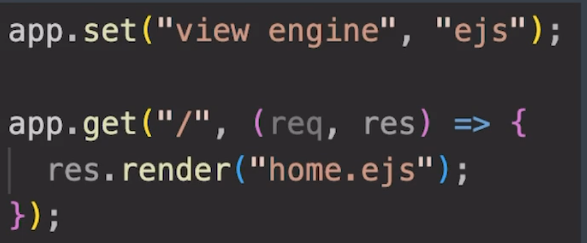

# EJS (Embedded  JavaScript templates):
EJS  is a simple templating language that lets you generate HTML markup with plain javascript.

# using EJS:
step 1:
npm install ejs

step 2:
put all ejs files in a views directory

step 2:
app.set("view engine", "ejs");

app.get('/', (req, res) => {
    res.render("home.ejs");
    // this line renders the filename.ejs file instead of sending a response.
    // usually we name the primary ejs file as home.ejs
});

step 3: 
note: By default the express tries to look up for a views directory to render the ejs files. but the problem is that express looks at the directory where server is running currently in, so views directory in the same level will not be searched. to change this we can add 2 lines 

const path = require("path");

app.set("views", path.join(__dirname, "/views"));

# example of set up ejs in index.js:
const express = require("express");
const app = express();
const path = require("path");
const port = 8080;

app.set("view engine", "ejs");
app.set("views", path.join(__dirname, "/views"));

app.listen(port, () => {
    console.log(`listening on https//localhost:${port}`);
});

app.get('/', (req, res) => {
    res.render("home");
});

# EJS interpolation syntax:
Interpolation refers to embedding expressions into html file. We can add javascript into ejs files directly.

home.ejs -> 
<%= // something %>

ex: <h1><%= ["bob","vampire","angel"][1] %></h1>\
op: vampire

# accessing data from js to ejs:
index.js ->
app.get('/random', (req, res) => {
    let data = Math.floor(Math.random() * 6);
    res.render("random", {num: data});
})

// now we can access num.
note: we can only pass objects so just sending data will not work.

instead of sending seperate {key: value} we can just do {value} and directly access it
ex: res.render("random", {data});

# writing conditionals and loops in ejs:
just enclose all the js part between <%  %>

ex:
    <% if(data == 6) { %>
        <h2>Congratulations! You can roll the dice again</h2>
    <% } %> 

# Serving static files:
using this below function we can add css to our ejs files.
app.use(express.static(path.join(__dirname, "public")));

step 1:
make a directory called public

step 2:
index.js ->
app.use(express.static(path.join(__dirname, "public")));

step 3:
views -> home.ejs ->
<link rel="stylesheet" href="/styles.css" />
note: don't need to do /public/styles.css because in step 2 we already specified that.

# making seperate folders for js and css:
step 1:
make directories inside public
public -> jsFiles
public -> cssFiles

step 2:
index.js ->
app.use(express.static(path.join(__dirname, "public/jsFiles")));
app.use(express.static(path.join(__dirname, "public/cssFiles")));

# including ejs inside ejs files:
<%- include("./extra.ejs") %>