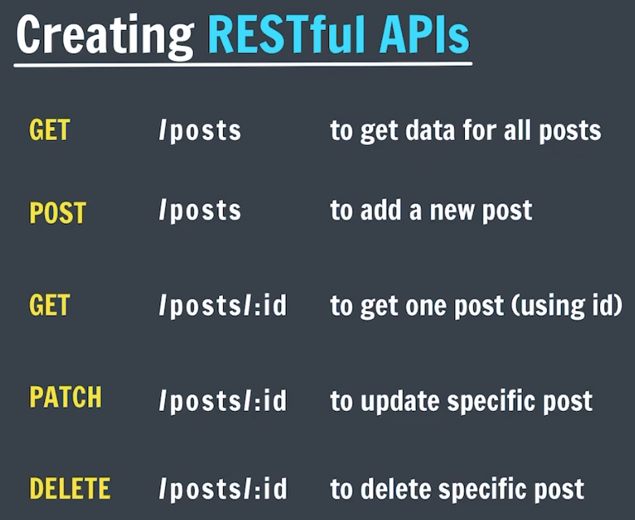

## REST:
REST stands for Representational State Transfer

REST is an architectural style that defines a set of constraints to be used for creating web services.

## CRUD:
C- create, R-read, U-update, D-delete

# CRUD operations:
GET - retrieves resources.
POST - submits new data to the server.
PUT - updates existing data.
PATCH - update existing data partially.
DELETE - removes data.

## Creating RESTful APIs:
here we create API that follow REST constraints

# neccesary routes for this project:
# method -> route -> meaning -> route type
GET -> /posts -> to get data for all posts -> index route
POST -> /posts -> to add a new post -> create route
GET -> /posts/:id -> to get one post (using id) -> view route
PATCH -> /posts/:id -> to update specific post -> update route
DELETE -> /posts/:id -> to delete specific post -> destroy route

# Redirecting:
res.redirect("/posts");

we should use this instead of res.render() because we don't need to render an entire page after it has been rendered once. any future redirect to them can be done with a res.redirect()

note: by default redirect sends a get request

# Making unique IDs:
step 1: npm install uuid

UUID stands for Universally unique identifier which helps us to make unique ids

step 2: const { v4: uuidv4} = require('uuid');

step 3: uuidv4() -> returns a unique string