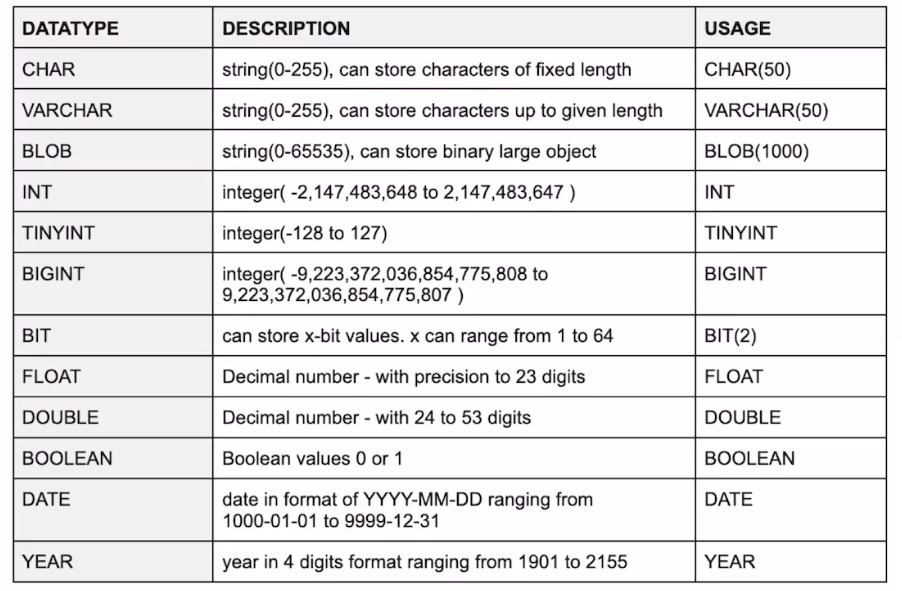
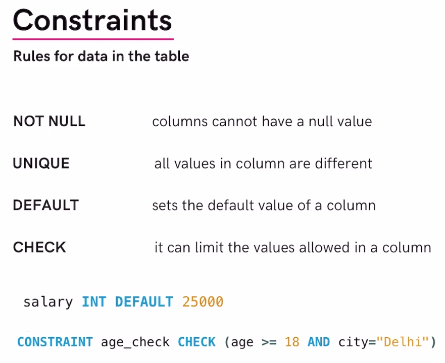
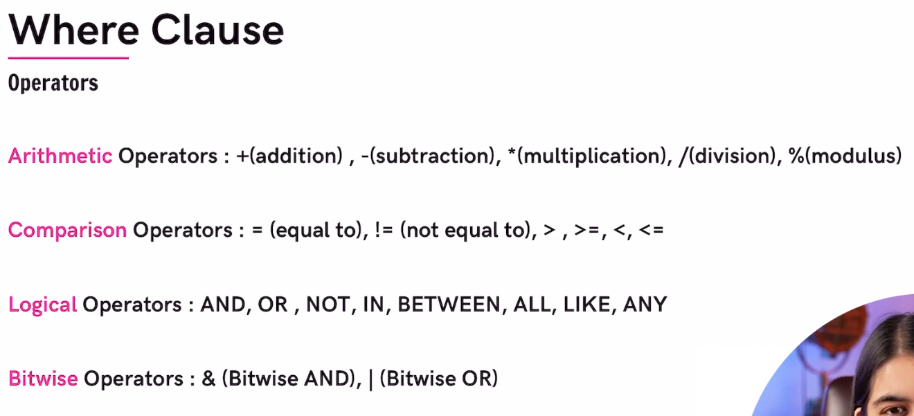
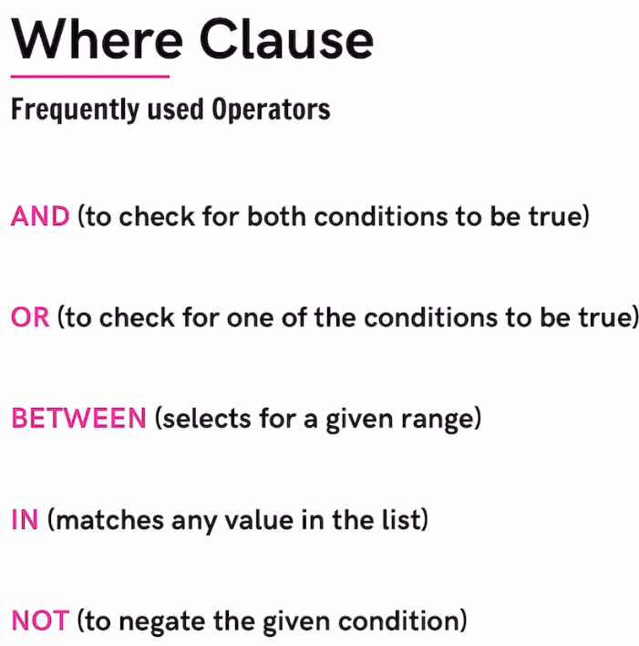
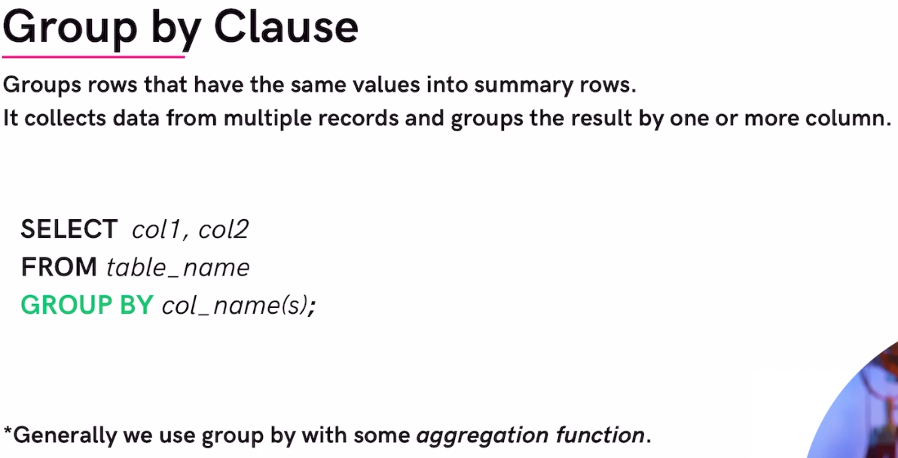
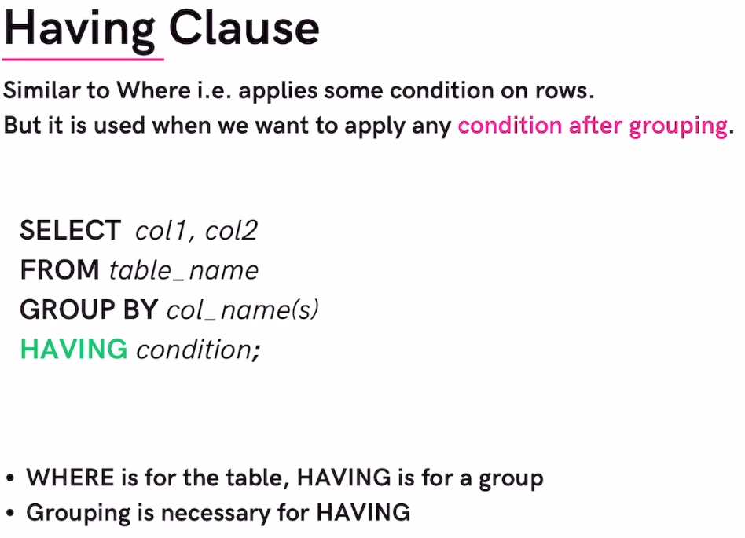
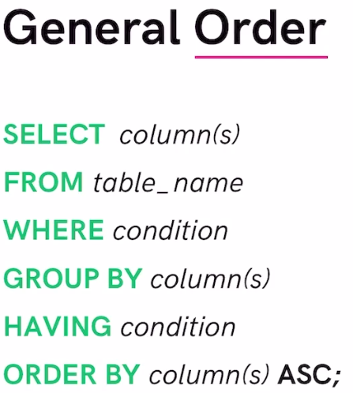
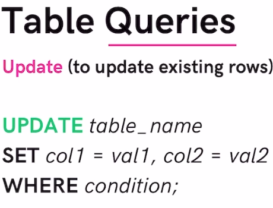
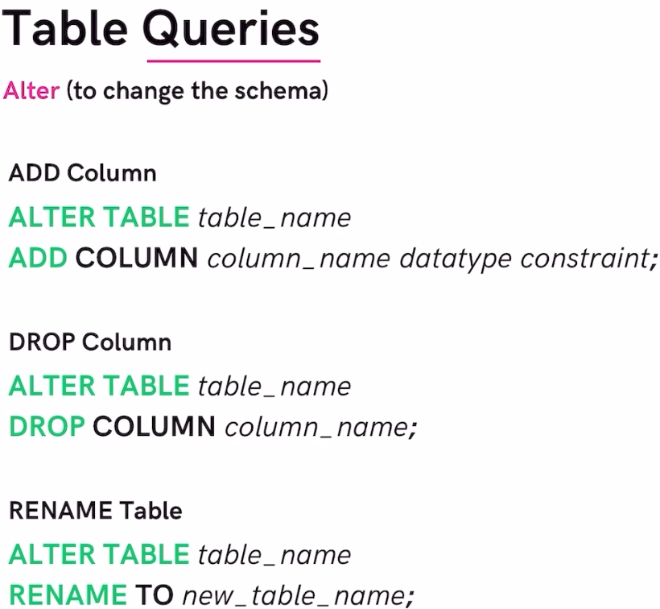
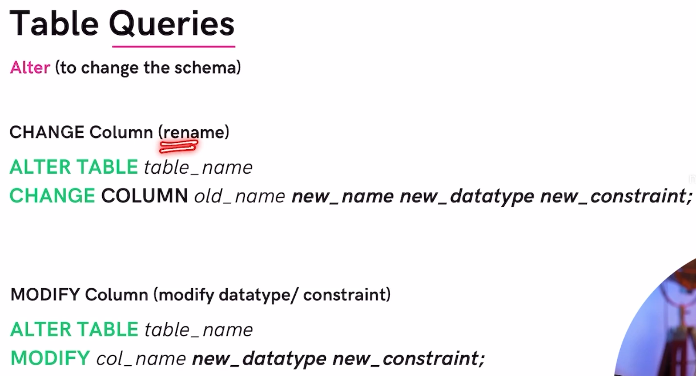

# SQL - Structured Query Language
SQL is a programming language which is used to interact with relational databases.

# columns in sql are called scheme-
scheme is the design of the table
ex: [id, name, age, grade]

# rows in sql are called tuples-
tuples contain information of a single user/entity

note: sql commands are 'NOT case sensitive' so both uppercase and lowercase works, but we generally use uppercase to show that we are using a sql command.

# keywords in sql are called clauses-
clauses such as CREATE, DROP, WHERE, etc...

# sql commands-
CREATE DATABASE db_name;
// creates a database

DROP DATABASE db_name;
// deletes a database

USE db_name;
// to be able to create tables we need to select the database using use command

# creating tables:
CREATE TABLE table_name(
    col_name1 datatype contstraint,
    col_name2 datatype contstraint,
    col_name3 datatype contstraint
);

note: defining constraints is optional

ex:
CREATE TABLE student (
 rollno INT,
 name VARCHAR(30),
 age INT
);

// here INT, VARCHAR are datatype and (30) is the constraint

# inserting data into those tables:
INSERT INTO student
VALUES
(101, "raj", 21),
(102, "guru prasad", 23),
(103, "akash" , 69);

INSTER INTO student
(id, name)
VALUES 
(104, "gagan"),
(105, "bobby");

# verify data from table
SELECT * FROM table_name;

# Database Queries:
CREATE DATABASE db_name;
CREATE DATABASE IF NOT EXISTS db_name;

// we add this extra line so that we can prevent errors. Such as create this database only if it doesn't already exist.

DROP DATABASE db_name;
DROP DATABASE IF EXISTS db_name;

SHOW DATABASES; // shows all the databases
SHOW TABLES;  // shows all the tables but before using this we need to USE DATABASE;

# List of datatypes in sql:

we can also add UNSIGNED to the numbers to make it unsigned type.
ex: TINYINT UNSIGNED

# CONSTRAINTS:

ex for NOT NULL: name VARCHAR(30) NOT NULL,
// this will ensure user cannot leave the name column empty

ex for UNIQUE: email VARCHAR(50) UNIQUE,

ex for DEFAULT: salary INT DEFAULT 25000 
note: name VARCHAR DEFAULT 'name' will not work, specify constraint like (30) ex: name VARCHAR(30) DEFAULT 'name' will work.

ex for CHECK: CONSTRAINT age_check CHECK (age > 18 AND nationality = 'indian')

// add the CONSTRAINT line within the table before the last line ');'

## extra CONSTRAINTS:
# PRIMARY KEY:
makes a column unique and not null but only used only for one table

only 1 primary key per table

CREATE TABLE customer (
    id INT NOT NULL,
    PRIMARY KEY (id)
);

note: to initialize primar key on the same like we could do "id INT NOT NULL PRIMARY KEY"

note: we can also do like PRIMARY KEY (id, name) to create composite primary key where we combine 2 values to create a primary key value.

# FOREIGN KEY:
prevents actions that would destroy links between tables.

foreign keys are is a column (or set of columns) in a table that refers to the primary key in another table.

foreign keys can have duplicate and null values and we can make multiple foreign keys in the same table.

CREATE TABLE temp (
    cust_id INT,
    FOREIGN KEY (cust_id) REFERENCES customer(id)
);

# visualize databases:
go to mysql -> databases -> reverse engineer

the diagrams created is called ER Diagram (entity relation) and the arrows connecting different tables are called relation.

# Showing data from the database:
// show everything ->
SELECT * FROM table_name;

// show particular cols ->
SELECT (col1, col2) FROM table_name;

// show unique values->
SELECT DISTINCT col_name FROM table_name;

ex: if there are multiple guru in the column name then SELECT DISTINCT name FROM students; -> will display only one guru instead of several.

# Where clause:
where is used to define some conditions.

ex: 
SELECT name FROM students
WHERE (age > 18);

# bitwise operators in sql:
& -> Bitwise AND
| -> Bitwise OR

# logical operators in sql:

ex for IN: 
select * from people
where name IN ('bob', 'kamal');
// shows all data where name is bob or kamal.

# Limit clause:
Sets an upper limit on number of tuples(rows) to be returned.

// using limit clause we can remove small/neccessary amount of data from a large query such as 5 names from 1000 names.

SELECT * FROM students
limit 14;
// shows only 14 students

# Sorting by ascending or decending:
select id, name from students
ORDER BY id ASC

// ASC for ascending and DESC for descending

# Aggregate functions:
Aggregate function are pre written functions which return a single value after performing calculations on a set of values.

ex: COUNT() // tells how many of selected are present
    MAX()
    MIN()
    SUM()
    AVG()

ex: 
SELECT MAX(followers) FROM user;

# GROUP BY:

note: we usually use an aggregrate function while making groups.

// can also do SELECT age, COUNT(id) to get both age and count
SELECT COUNT(id) 
FROM user
GROUP BY age;
// what happens here is we group people into age groups and then count number of id in that age group and return it. if we have 2 people who are age 45yo then we are returned with 2

note: if we haven't aggregated something we can't select it unless we also group it in the same category..ex we can't do SELECT age,name and then do GROUP BY age...we have to aggregate name since it is not grouped.

# HAVING:
it is similar to where but for groups.

# GENERAL ORDER OF WRITING AN SQL COMMAND:

# UPDATE and SET

UPDATE requires SET and WHERE.
// without where it will set as default value

note: if we are getting errors about running in safe mode use the below line

SET SQL_SAFE_UPDATES = 0;

# DELETE -> delete rows:
DELETE clause is used to delete rows

ex:
DELETE FROM user
WHERE id = 133;

# ALTER:
ALTER clause is used to change table schema

# TRUNCATE -> delete all data from a table.
TRUNCATE TABLE table_name;