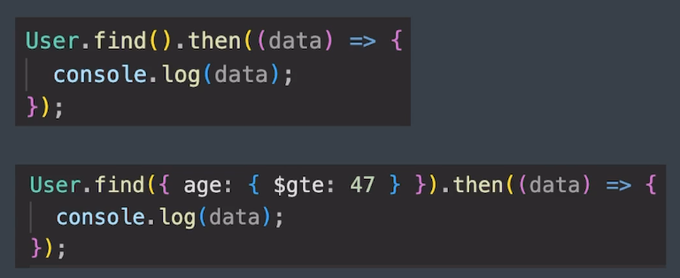

# *`Mongoose`*:
mongoose is a library that creates a connection between MongoDB and Node.js Javascript Runtime Environment

It is an ODM (Object Data Modeling) Library.

## Installing mongoose:
npm i mongoose

## Boilerplate to use mongoose:
const mongoose = require('mongoose');  

## Connecting to mongodb:
mongoose.connect('mongodb://127.0.0.1:27017/test');  
// this line returns a promise so we use it in a async function like below

``` js
main().then((res) => console.log("connection successful"))
.catch((err) => console.log(err)); 
// running the main() function and checking for errors or results.

async function main() {
    await mongoose.connect('mongodb://127.0.0.1:27017/test');
}
```
## Schema for our collections:
Schema defines the shape of the documents within that collection.

We can quickly make a overall structure for our collections like below:  
```js
// making my own schema
const teacher = new Schema({
    name: String,
    work_experience: [{ body: String, date: Date }],
    extras: {
        hobbies: String,
        salary: Number
    }
});

/* The above is a blueprint, we might make a document for above collection like this
{
    name: 'bobby deol',
    work_exprerience: [
        {body: 'swe at google', date: new Date('2027-02-13')},
        {body: 'lead engineer at nasa', date: new Date('2035-06-12')}
    ],
    extras: {
        hobbies: 'playing video games, listening to music',
        salary: 145,000
    }
}
*/
```

[check all the schema types allowed in mongoose](https://mongoosejs.com/docs/guide.html)

## Model for constructing documents in collections:
Model in mongoose is a class with which we construct documents.  
```js
const Employee = mongoose.model("Employee", employeeSchema);  
// this creates a collection called Employee that uses employeeSchema
// we can do mongosh and bash 'use test' database and bash 'show collections' to see employees
```

note 1: even though we gave the collection the name Employee, mongodb automatically converts it into smaller case and plural i.e employees.  
note 2: by convention the variable is same as inside model arguments and first letter is capital.  

models act as bridge between mongodb and javascript. Enabling us to use mongodb convinently using mongoose built in methods like  
```js 
await Employee.create({name: 'bobby deol', age: 45})
// this will still use the employeeSchema schematics
```

# Creating / Inserting documents in mongoose:
## Method 1: Inserting by making an object which is instance of Model and then saving it in database:
```js
const Employee = mongoose.model("Employee", employeeSchema)
// above line creates a collection called employees in the test database if we check in mongosh

const chaitanya = new Employee(
    // creates a new document chaitanya locally (creates an instance of the model)
    {
        name: 'chaitanya',
        work_experience: [{body: 'rocket scientist at nasa'}, {date: new Date('2027-02-13')}],
        extras: {
            hobbies: 'touching grass',
            salary: 350000
        }
    }
);

chaitanya.save()
// to save in the DB.
```

## Inserting multiple values:\
``` js
Model.insertMany(
    [
        {obj1},
        {obj2},
        {obj3}
    ]
)
// just pass in an array of objects, where each object is a document.
```

## mongoose operation buffering:
A feature in mongoose is that it allows us to start using our Models immediately without waiting for mongoose to establish a connection with MongoDB. Hence we don't need to write all this code in the .then function of main().  

i.e we don't wait for the main() function to establish connection to mongodb and then in it's then() block we write all the Models. Instead we can write it seperately and mongoose let's us do that even if it fails to connect with mongodb.  

## Query Objects in mongoose:
some methods return a Query object to which we can attach a .then(data) but it is not a promise. One example of such method is User.find()  

note: mongoose queries are not promises but lets us use a .then() or .catch()

# find():

```js 
// find all: 
await Employee.find({});  

// find by id:  
Employee.findById("myid");  
```


[more models like find()](https://mongoosejs.com/docs/api/model.html)  

## using condition in find():
```js
Employee.find({age: {$gt: 23}}).then().catch()
```  

# Update():
```js
// update one:
Employee.updateOne({_id: "xyz"}, {salary: 45000}).then(res).catch(err);

// update many:
Employee.updateMany({age: {$gt: 32}}, {salary: 23000})

// find by id and update:
Employee.findByIdAndUpdate({"myid"}, {salary: 34444}, {new: true})
``` 

[findOne]

# Difference between updateOne and findOneAndUpdate:
### `Model.updateOne()`

```javascript
await Workout.updateOne(
  { _id: id },           // filter - find document
  { exercise: 'Squats' } // update - what to change
)
```

`Returns:`  
```javascript
{ acknowledged: true, modifiedCount: 1, upsertedId: null }
```
- You get info ABOUT the update (how many docs modified)
- You DON'T get the updated document itself

### `Model.findOneAndUpdate()`

```javascript
const updated = await Workout.findOneAndUpdate(
  { _id: id },           // filter
  { exercise: 'Squats' },// update
  { new: true }          // option: return updated doc
)
```

`Returns:`  
```javascript
{
  _id: 123,
  exercise: 'Squats',
  sets: 3,
  reps: 10,
  ...
}
```
- You get the **actual updated document**
- More useful when you need the data back

## Comparison

| Method | Returns | Use When |
| --- | --- | --- |
| `updateOne()` | Update info only | You don't need the document data |
| `findOneAndUpdate()` | Actual document | You need to send updated data back to client |

**Use `findOneAndUpdate()` for APIs** - clients expect to see the updated data. That's what I showed in the example code earlier. 👍

## Delete:
```js
Model.deleteMany({name: 'sunil'}) // delete all sunils.  
Model.delteMany({}) // delete everything in the collection.
Model.deleteOne({name: 'keerthan'}) // deletes one keerthan.
// above methods show only deleted count and success and failure


// to see what document was deleted
Model.findOneAndDelete()
Model.findByIdAndDelete()
```

# Schema Validations:
It is basically setting additional rules for our schemas

```js
const bookSchema = new mongoose.schema({
    title: {
        type: String, 
        required: true // means cannot be null value
    },
    price: {
        type: Number,
        min: [1, "price is too low"], // minimum is 1, if below that is set we throw our custom error in the array.
        default: 78
    },
    genre: [String] // array of strings
})
```

another useful validator is enum, which allows us to create only the data within a specific array, example we want strictly only 3 colors in trafic lights  
```js
// ex:
enum: ['red', 'green', 'blue']
```
`Making custom errors in schema:`
```js
price: {
    min: [1, "can't set below 1"]
}
```
[more reading on schema types](https://mongoosejs.com/docs/schematypes.html#all-schema-types)

## Validation in update:
the validators only work on inserting and not when using any update method. To make them check validators we include  
```js
Module.findByIdAndUpdate("myid", {type: Number}, {runValidators: true})
```

